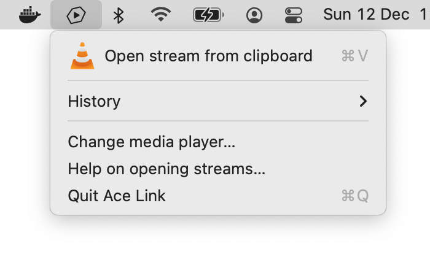

# Ace Link

Ace Link is a macOS menu bar app that allows playing Ace Stream video streams in VLC player. 

Paste an Ace Stream hash in the Ace Link menu. Ace Link will launch the Ace Stream server in Docker and open your stream in VLC. You can also launch Ace Link by opening an acestream:// link directly from a website.

Install Ace Link via the link below or using [Homebrew](https://brew.sh): `brew install --cask ace-link`

## [Download for macOS](https://github.com/blaise-io/acelink/releases/download/1.9.0/Ace.Link.1.9.0.dmg)

Requires VLC, Docker and macOS High Sierra (10.13) or higher.



Ace Link is an unsigned app because Apple does not allow p2p related applications. If your version of macOS does not allow opening unsigned applications, [follow these instructions to bypass this restriction](http://osxdaily.com/2016/09/27/allow-apps-from-anywhere-macos-gatekeeper/).

 - [Download an older version](https://github.com/blaise-io/acelink/releases)


### Ace Stream server only

If you want to play a stream in a player other than VLC, you only need Docker to be installed. Just run `docker run --rm -p 6878:6878 blaiseio/acelink` in a terminal and open `http://127.0.0.1:6878/ace/getstream?id=<acestream hash>` in a player with HLS support. You don't need to download or install Ace Link. You can also play a stream in the bundled web player at `http://127.0.0.1:6878/webui/html/player.html?id=<acestream hash>` (experimental).

If you want to use a custom config file, mount it at `/opt/acestream/acestream.conf`. Example: 
```
docker run --rm -p 6878:6878 -v "$(pwd)/acestream.conf:/opt/acestream/acestream.conf" blaiseio/acelink
```
