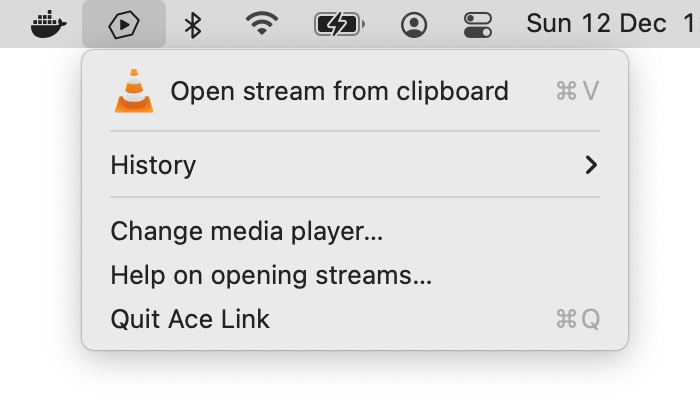

# Adding notes to a project (classic)

> [!WARNING]
> Due to time constraints, I will not review issues or pull requests unless core functionality is broken for most users. I am open to transferring ownership of this project to contributors who have selflessly helped improving this project in 2025 or before. You are also welcome to fork the project. If a fork gains traction within the community, I will archive this project and link to the fork.

   
3. Click **Convert to issue**.
4. If the card is on an organization-wide project (classic), in the drop-down menu, choose the repository you want to add the issue to.
5. Optionally, edit the pre-filled issue title, and type an issue body.
6. Click **Convert to issue**.
7. The note is automatically converted to an issue. In the project (classic), the new issue card will be in the same location as the previous note.

## Editing and removing a note

1. Navigate to the note that you want to edit or remove.
2. In the upper-right corner of the notes, click <svg version="1.1" width="16" height="16" viewBox="0 0 16 16" class="octicon octicon-kebab-horizontal" aria-label="Card menu" role="img"><path d="M8 9a1.5 1.5 0 1 0 0-3 1.5 1.5 0 0 0 0 3ZM1.5 9a1.5 1.5 0 1 0 0-3 1.5 1.5 0 0 0 0 3Zm13 0a1.5 1.5 0 1 0 0-3 1.5 1.5 0 0 0 0 3Z"></path></svg>.

   
3. To edit the contents of the note, click **Edit note**.
4. To delete the contents of the notes, click **Delete note**.

## Further reading

* [About projects (classic)](/en/enterprise-server@3.14/issues/organizing-your-work-with-project-boards/managing-project-boards/about-project-boards)- [Creating a project (classic)](/en/enterprise-server@3.14/issues/organizing-your-work-with-project-boards/managing-project-boards/creating-a-project-board)
* [Editing a project (classic)](/en/enterprise-server@3.14/issues/organizing-your-work-with-project-boards/managing-project-boards/editing-a-project-board)
* [Adding issues and pull requests to a project (classic)](/en/enterprise-server@3.14/issues/organizing-your-work-with-project-boards/tracking-work-with-project-boards/adding-issues-and-pull-requests-to-a-project-board)

# Ace Link

Ace Link is a menu bar app that allows playing Ace Streams on macOS. 

Play an Ace Stream or Magnet in any media player by pasting the URL in the Ace Link menu, or open an acestream or magnet link in Ace Link.

## [Download for macOS](https://github.com/blaise-io/acelink/releases/download/2.1.0/Ace.Link.2.1.0.dmg)

 - Install using HomeBrew: `brew install --cask ace-link`
 - [Download an older version](https://github.com/blaise-io/acelink/releases)

Requires Docker and macOS High Sierra (10.13) or later.



### Media players

Ace Link allows selecting your own media player. Ace Link does not transcode streams, so pick a player that supports popular audio and video codecs. VLC, IINA and MPV are free and open source media players that are able to play nearly anything. QuickTime and web browsers will play most streams, but not all. 

### Signing

Ace Link is an unsigned app because Apple does not allow p2p related applications. If your version of macOS does not allow opening unsigned applications, [follow these instructions to bypass this restriction](https://apple.stackexchange.com/a/240560).

### Ace Stream server only

If you just want to run the AceStream engine, you can do so without Ace Link:

```sh
docker run --platform=linux/amd64 --rm -p 6878:6878 blaiseio/acelink
# now open http://<network ip>:6878/ace/getstream?id=<acestream id>
# or http://<network ip>:6878/ace/getstream?infohash=<magnet uri> in a player
```

If you want to use a custom acestream.conf: 
```
docker run --platform=linux/amd64 --rm -p 6878:6878 -v "$(pwd)/acestream.conf:/opt/acestream/acestream.conf" blaiseio/acelink
```

### View Ace Link logs

1. Open Console.app
2. In the Console.app search field, type `Process: Ace Link`
3. Click on *Start* or *Start streaming*
4. Launch Ace Link and perform an action you want to debug
5. It should now start populating Console.app with debug information
